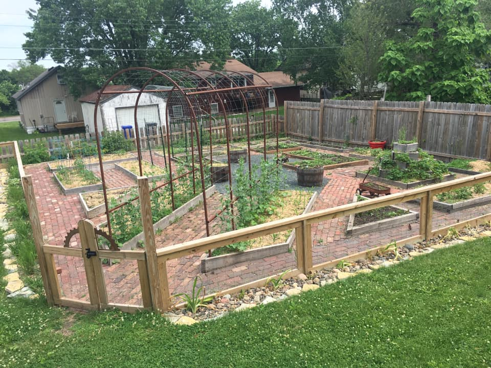
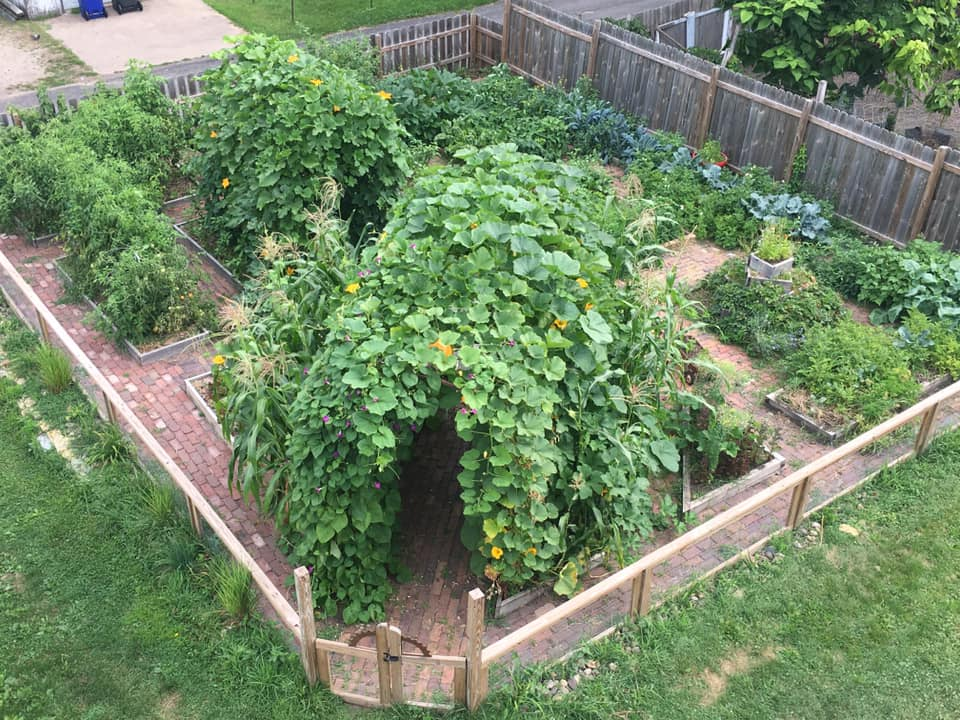
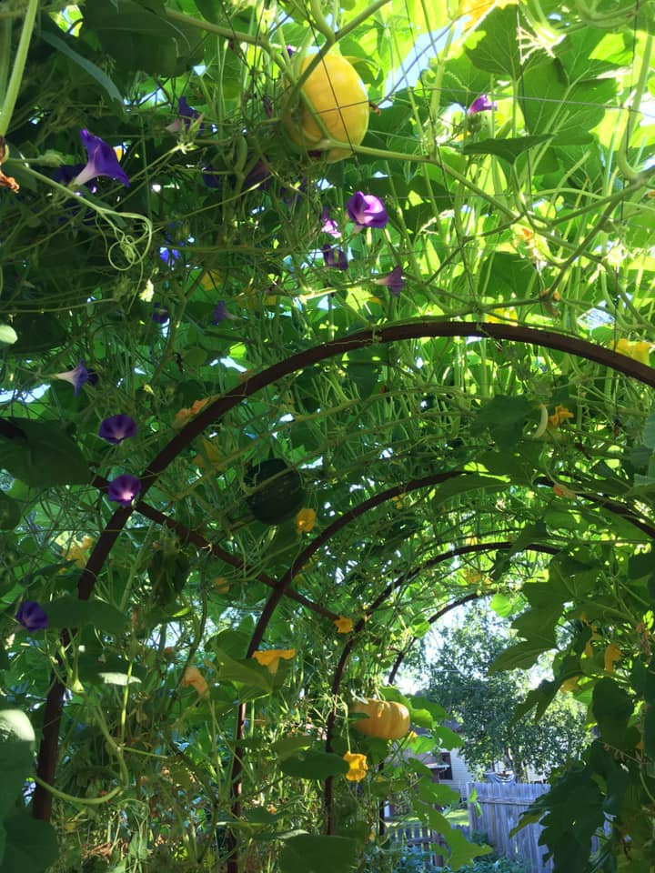
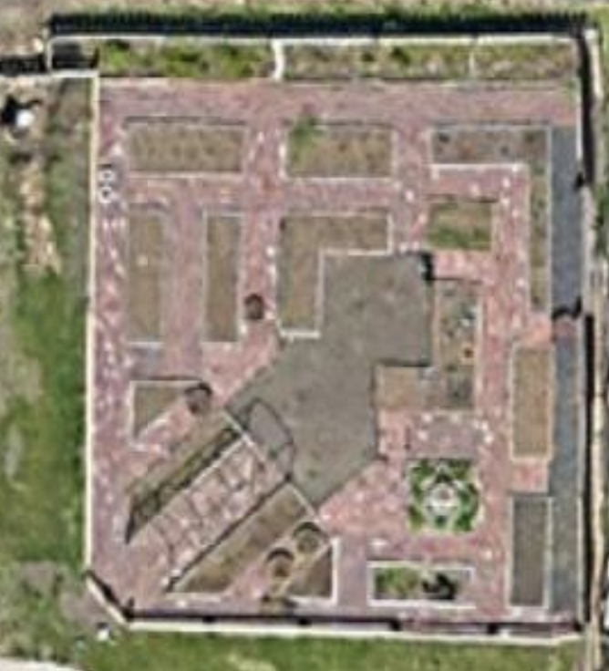
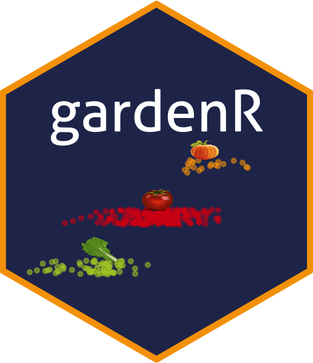

```{r setup, include=FALSE}
knitr::opts_chunk$set(echo = FALSE)
```

## The Jungle Garden

I started vegetable gardening in 2004 and have been hooked ever since. During graduate school, while learning about split-plots and nested designs, I dreamed about experimenting in my own garden but never quite found the motivation.

This past summer I finally decided to at least collect some data from my garden. I did this for two reasons: 1. I was curious about how much food I produced. 2. I wanted to use the data in my Introductory Data Science course at Macalester College. I knew the data would be fairly simple and I liked that it would be a bit personal and give a way for me to connect with students. This felt especially important this year while I have been teaching remotely.

I could spend a lot of time talking about my garden, but I'll keep it brief. I plan to eventually put a post in my "Non-R Stuff" area for those who are into gardening as much as they are into R. But, for now, I'll just show some photos of early season vs. late season garden. Hopefully this helps illustrate why I fondly refer to it as the jungle garden. Truthfully, the garden at my old house was more of a jungle since it sprawled across my backyard more, but I think this one is still worthy of the name.  

<center>

:::: {style="display: flex;"}

::: {}

{width=90%}

:::

::: {}

{width=90%}

:::

::::

{width=40%}

</center>

I am personally most proud of the brick paths - I laid each individual brick except for the occasional help from my kids and neighbor kids who I paid $.10/brick (thankfully they got bored quickly!). I also have to give my husband Chris credit for the fence and raised bed boxes, although I did make all the fence post holes (with a manual fence post digger!).

## Collecting the Data

Before I could make a data package, I had to collect the data. This was both an awful and great experience. I think anyone who analyzes data should have a go at collecting their own data at least once. Even in this very small endeavor of mine, I learned a lot. 

I took some time thinking about the data I might want to analyze and tried my best to set up spreadsheets to collect everything I thought I would need. I made four Google sheets:

1. Spending: how much I spent on seeds, plants, etc. for the garden.  
2. Planting dates: when, where, and how much of each seed/plant was planted  
3. Harvest data: how much of each vegetable variety was harvested. Each row is a "harvest" of a particular vegetable variety. So, each time I harvested a particular vegetable/variety combination, I weighed the entire harvest. There could be multiple harvests of a vegetable/variety combination in a single day. There are two exceptions: all pumpkin and winter squash (vegetable = "squash") were weighed individually.  
4. Plot coordinates: grid coordinates to identify the various plots in the garden (see photo on right).

<aside>
```{r, fig.cap="Bird's-eye view of garden"}

```
</aside>

I liked putting the data in Google sheets because I could use Jenny Bryan's {googlesheets4} package to interact with the data as I was collecting it. 

At the beginning the summer, I really enjoyed weighing all the harvests. It was exciting to see how much food we grew on our own! But, by mid-summer, I was already starting to get annoyed by having to collect the data. Do you notice there's very little raspberry data? That's because I ate it before I weighed it - usually while weeding the garden. I also noticed (just anecdotally) that I felt more pressure on myself to use all the food I harvested and not let any go to waste. So, I think my family and I did a good job eating even more of the veggies than usual and neighbors probably got annoyed with me asking them to please take some zucchinis off my hands. 


## Creating {gardenR}, a Data Package

After using the data I collected with two sections of my Introductory Data Science students, I decided it was time to package it up and share it with others. If you want to see examples of how I used the data, check out the tutorials on my course [website](https://ds112-lendway.netlify.app/). 

### Step 0: Make a hex sticker!

I started by coming up with the name for the data package and making a hex sticker. Is this where you should start? Probably not, but maybe? It gave me the motivation I needed to see it through. I used the {hexSticker} package by Guangchuang Yu to create mine. Check out more about that [here](https://github.com/GuangchuangYu/hexSticker). I also ordered way more stickers than I'll probably ever need via [stickermule](https://www.stickermule.com/) - if you want some, get in touch with me :)

<aside>
```{r}

```
</aside>


### Step 1: Read some great resources

The three resources I ended up using are:

* [rstudio4edu](https://rstudio4edu.github.io/rstudio4edu-book/data-pkg.html#data-pkg) Chapter 12: Create a data package by Desirée De Leon and Alison Hill. I'm pretty sure that everything I learn about R lately is from these two. Although they are both experienced R users, they are also amazingly good at writing tutorials and how-to's from the perspective of someone who has never done the task before. I loved the "Is this tutorial for you?" checklist at the top of the section. Right away I knew - yes! That is me! This is for me!  

* [Writing an R Package from Scratch](https://r-mageddon.netlify.app/post/writing-an-r-package-from-scratch/) by Tomas Westlake, which is an update of Hilary Parker's [blog post](https://hilaryparker.com/2014/04/29/writing-an-r-package-from-scratch/) on the same topic. 

* [R Packages](https://r-pkgs.org/git.html#github-init) book - really just section 18.9 and for looking at a second set of screenshots of documentation to make sure I did it correctly. There is probably a lot more I should read about in here, which I hope to do someday.

### Step 2: Make the package

Because there are already so many great resources out there, I am going to highlight how I used them, rather than make a new resource. I ended up using a combination of resources because I wasn't able to follow any of the instructions exactly, without running into differences or errors. There is a good chance this is due to some mistakes I made along the way.

1. Load required libraries. This step seemed to be the same across all resources.

```{r, eval=FALSE}
library(devtools)
library(roxygen2)
library(usethis)
```

2. Create the package. I used steps 1-3 of the "though we don't recommend starting this way" way of creating a data package project in the [section 12.3.2 of the rstudio4edu](https://rstudio4edu.github.io/rstudio4edu-book/data-pkg.html#two-getting-started-workflows) material (scroll to the bottom of the section): 1. click File > New Project > New Directory, 2. select R Package, 3. Put in a package name, click create git repository (my addition), and click Create Project. I did this because when I tried first creating the GitHub repo, I couldn't clone the repo without having a README (again, this is probably my error). After it runs, many new files will be created for you. This will give you a great start to your data package.

<center>
{width="95%"}
</center>

3. Synchronize with GitHub. Because I didn't do this first, I wanted to make sure to do it as soon as possible. I tried using the `use_github()` function from {usethis} as recommended by both rstudio3edu and Westlake resources, but I couldn't get it to work. So, instead, I followed the instructions in [section 18.9 of R Packages](https://r-pkgs.org/git.html#github-init): 1. Create a new GitHub repo with the same name as your package **without** a README. 2. After doing this, an instruction page opens that tells you to copy and paste some code into a shell - do that. The code I had to copy was this - yours will be similar but specific to your package and GitHub username:

```
git remote add origin https://github.com/llendway/gardenR.git
git branch -M main
git push -u origin main
```

4. After I had it synched with GitHub, I used Parts 2-6 (Sections 12.4-12.8) of the [rstudio4edu resource](https://rstudio4edu.github.io/rstudio4edu-book/data-pkg.html#part-2-add-some-clean-data). I followed their steps exactly - they even remind you to commit! 

5. Add a README. I wanted a nice page to welcome people. I followed Steps 8 & 9 of [Writing an R Package from Scratch](https://r-mageddon.netlify.app/post/writing-an-r-package-from-scratch/) to help me create a nice README file that includes the hex sticker logo :)


### Step 3: Share the package with others

That's what I plan to do very soon on Twitter. If you are reading this, it probably means I did it. Check out the {gardenR} package repo [here](https://github.com/llendway/gardenR).
