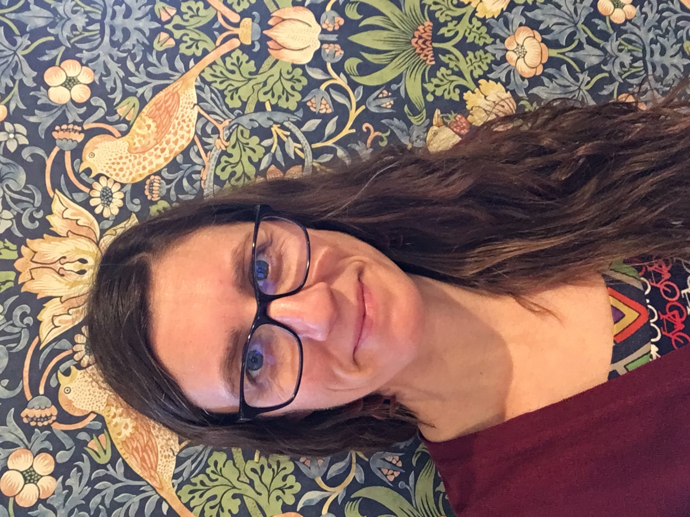
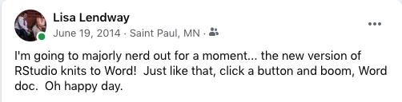
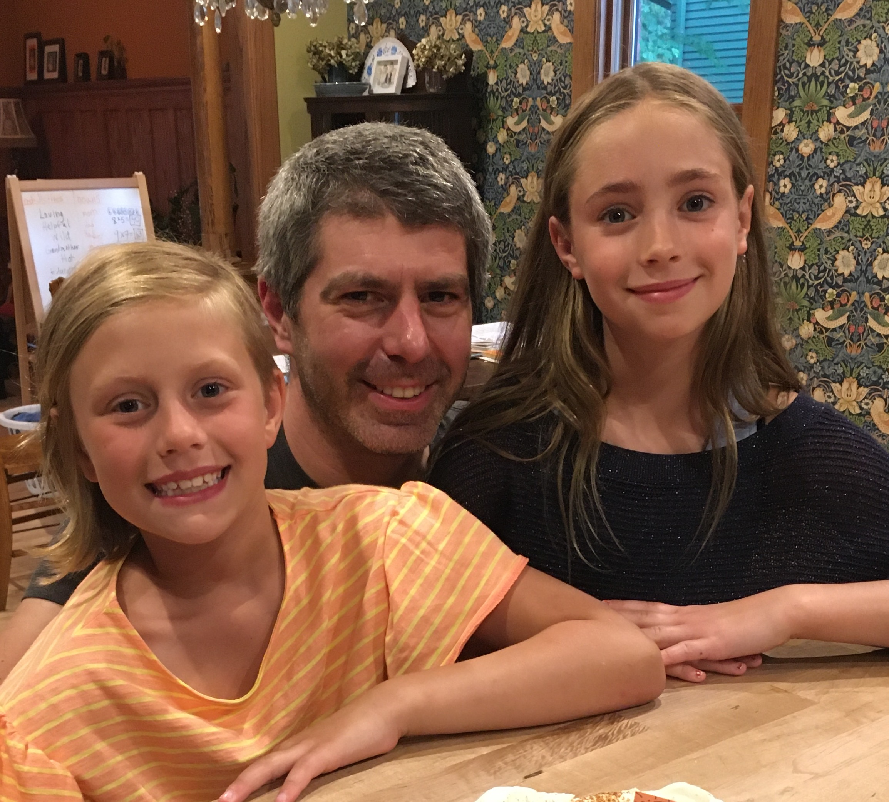
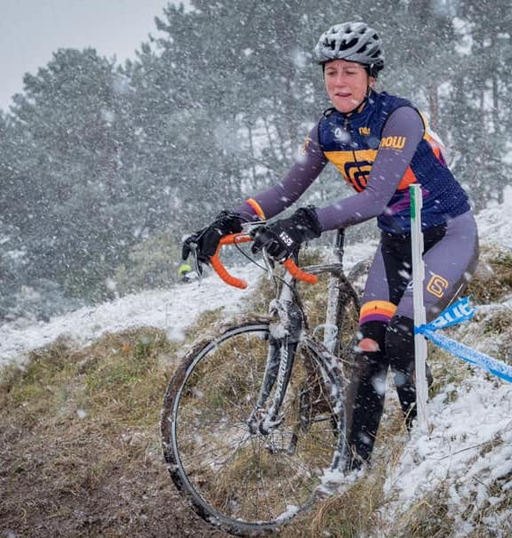
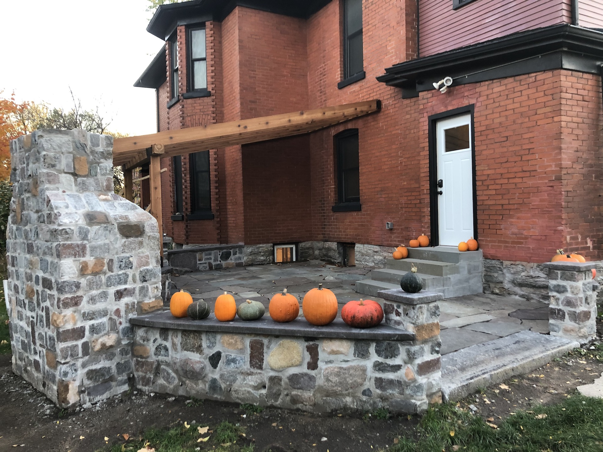

<script async defer data-domain="lisalendway.netlify.app" src="https://plausible.io/js/plausible.js"></script>

```{r setup, include=FALSE}
knitr::opts_chunk$set(echo = FALSE)
```

{width=50%}

Professionally, I am a professor of statistics and data science at [Macalester College](https://www.macalester.edu/mscs/) and R Studio certified instructor of tidyverse. I have used R since 2003 (whoa!) in many different roles: student, statistician/data scientist, and teacher. I have always enjoyed teaching people how to use R, but love it even more since the creation of R Markdown. If you are new to R and R Studio, you might find my [tutorials](https://ds112-lendway.netlify.app/) from my introductory data science class helpful. 

<center>
{width=70%}

</center>

I am also a mom and spouse. I enjoy tending to my [jungle garden](https://www.pinterest.com/pin/383017143315005418/) (that's how I fondly refer to my backyard garden) in the summers, cycling outdoors or indoors when necessary, and working on remodeling and restoring our house. 

<center>

:::: {style="display: flex;"}

::: {}

{width=90%}

{width=90%}

:::

::: {}

{width=70%}

{width=70%}

:::

::::

</center>

## Education

PhD in Statistics, 2012  
University of Minnesota, [School of Statistics](https://cla.umn.edu/statistics)


BA in Mathematics and Spanish, 2003  
[Macalester College](https://www.macalester.edu/)

## Work Experience

Assistant Professor (NTT), 2021-present  
Visiting Assistant Professor, 2012-2013 & 2017-2020  
Macalester College

Statistics and Advanced Analytics Consultant, 2016-2017  
Securian Financial

Senior Data Scientist, 2014-2016  
Allina Health / Health Catalyst

Senior Biostatistician, 2013-2014  
HealthEast

Data Analyst, 2003-2006  
Target Corporation


## Contact

The easiest way to contact me, is to tweet me [`@lisalendway`](https://twitter.com/lisalendway)! If you are interested in having me lead a training, feel free to [email me](mailto:lisalendway@gmail.com).  
