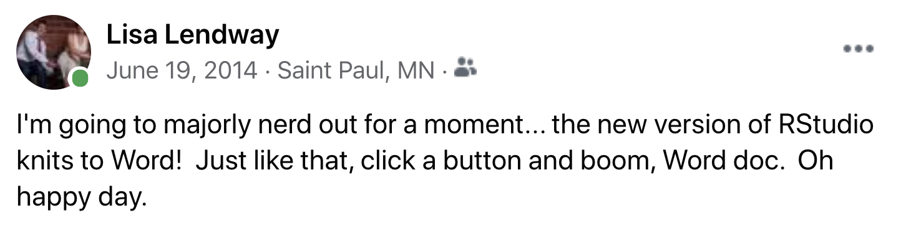

```{r setup, include=FALSE}
knitr::opts_chunk$set(echo = FALSE)
```

{width=50%}

Professionally, I am a professor of statistics and data science at [Macalester College](https://www.macalester.edu/) and R Studio certified instructor of tidyverse. I have used R since 2003 (whoa!) in many different roles: student, statistician/data scientist, and teacher. I have always enjoyed teaching people how to use R, but love it even more since the creation of R Markdown. If you are new to R and R Studio, you might find my [tutorials](https://ds112-lendway.netlify.app/) from my introductory data science class helpful. 

<center>
{width=70%}

</center>

I am also a mom and spouse. I enjoy tending to my [jungle garden](https://www.pinterest.com/pin/383017143315005418/) (that's how I fondly refer to my backyard garden) in the summers, cycling outdoors or indoors when necessary, and working on remodeling and restoring our house. 

{width=35%}
{width=30%}

{width=30%} 
{width=35%}


## Education

PhD in Statistics
University of Minnesota, School of Statistics, 2012


BA in Mathematics and Spanish
Macalester College, 2003

## Work Experience

Visiting Assistant Professor
Macalester College, 2012-2012 & 2017-present

Statistics and Advanced Analytics Consultant
Securian Financial, 2016-2017

Senior Data Scientist
Allina Health / Health Catalyst, 2014-2016

Senior Biostatistician
HealthEast, 2013-2014

Data Analyst
Target Corporation, 2003-2006


## Contact

If you are interested in having me lead a training, feel free to [contact me](mailto:lisalendway@gmail.com).  
